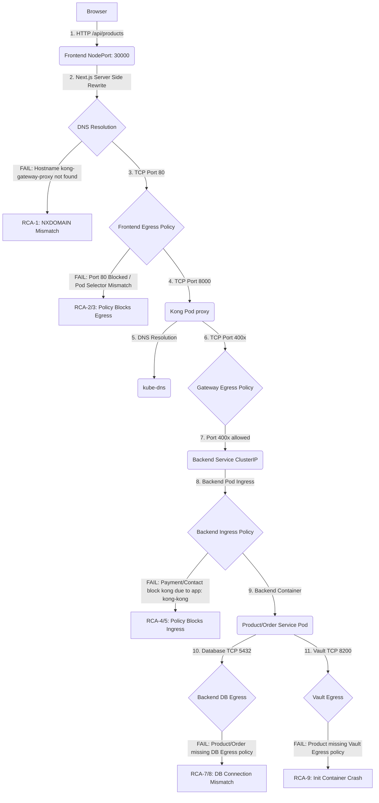

# Root Cause Analysis: Ingress and Service Routing Issues

This document provides a comprehensive Root Cause Analysis (RCA) of the routing failures in the ShopPay on-premises microservices deployment.

---

## Executive Summary

The migration from a single ingress to a distributed ingress-per-microservice model under strict network isolation has introduced several connectivity blocks. We have identified **10 distinct routing issues** categorized by severity:
* **Critical (8 issues):** Direct causes of service startup failure or absolute connection drops in the application flow.
* **High (2 issues):** Blocks that prevent external testing/validation or fail crucial inter-service operations under production conditions.

No architectural redesign or replacement of core technologies (Kong, Helm, NetworkPolicies) is necessary. The issues stem from **label mismatches**, **missing egress permissions**, and **DNS configuration errors** within the Helm templates.

---

## Detailed Request Flow & Failure Points

Here is how a standard request travels through the platform and where it breaks:



---

## Summary of Identified Issues

| Rank | Issue ID | Description | Affected Component |
| :--- | :--- | :--- | :--- |
| **Critical** | **RCA-1** | Invalid Kong Proxy hostname in Next.js Server-Side Rewrites | Frontend |
| **Critical** | **RCA-2** | Frontend Egress NetworkPolicy blocks port 80 (standard service port) | Frontend NetworkPolicy |
| **Critical** | **RCA-3** | Frontend Egress NetworkPolicy uses mismatched pod selector (`app: kong-kong`) | Frontend NetworkPolicy |
| **Critical** | **RCA-4** | Payment Ingress NetworkPolicy blocks Kong due to mismatched pod selector | Payment NetworkPolicy |
| **Critical** | **RCA-5** | Contact Ingress NetworkPolicy blocks Kong due to mismatched pod selector | Contact NetworkPolicy |
| **Critical** | **RCA-6** | Order Service lacks Egress NetworkPolicy to call Payment Service | Order NetworkPolicy |
| **Critical** | **RCA-7** | Product Service lacks Egress NetworkPolicy to connect to its PostgreSQL DB | Product NetworkPolicy |
| **Critical** | **RCA-8** | Order Service lacks Egress NetworkPolicy to connect to its PostgreSQL DB | Order NetworkPolicy |
| **Critical** | **RCA-9** | Product Service lacks Egress NetworkPolicy to connect to HashiCorp Vault | Product NetworkPolicy |
| **High**     | **RCA-10** | Kong Gateway lacks Ingress NetworkPolicy for public/external traffic | Gateway NetworkPolicy |

---

## 1. Critical Issues

### RCA-1: Invalid Kong Proxy Service Name in Frontend Configuration
* **File Name:** `frontend/next.config.js` and `charts/shoppay/templates/frontend.yaml`
* **Exact Location:** `frontend/next.config.js#L6-L8`
* **Why it is wrong:** 
  The Next.js backend proxy rewrites `/api/*` requests on the server side using the fallback URL `http://kong-gateway-proxy.shoppay-gateway.svc.cluster.local`. However, the Kong gateway chart is deployed with the release name `kong` inside namespace `shoppay-gateway`, which yields a proxy service named `kong-kong-proxy` instead of `kong-gateway-proxy`. Moreover, the environment variable `INTERNAL_API_BASE_URL` is never injected into the frontend pod in `frontend.yaml`. This results in a name resolution error (`NXDOMAIN`).
* **What Kubernetes expects:**
  The frontend container must target the actual Kubernetes DNS name of the Kong proxy service: `http://kong-kong-proxy.shoppay-gateway.svc.cluster.local`.
* **Minimal Fix:**
  1. Update `frontend/next.config.js` fallback:
     ```javascript
     const apiTarget =
       process.env.INTERNAL_API_BASE_URL ||
       "http://kong-kong-proxy.shoppay-gateway.svc.cluster.local";
     ```
  2. Inject the environment variable in `charts/shoppay/templates/frontend.yaml` dynamically:
     ```yaml
               env:
                 - name: PORT
                   value: {{ .Values.frontend.env.port | quote }}
                 - name: HOSTNAME
                   value: "0.0.0.0"
                 - name: NODE_ENV
                   value: "production"
                 - name: INTERNAL_API_BASE_URL
                   value: "http://kong-kong-proxy.{{ .Values.namespaces.gateway }}.svc.cluster.local"
     ```
* **Why this fix is correct:** It aligns the proxy destination with the correct service name and exposes it as an environment variable to prevent hardcoding.
* **Verification Command:**
  ```bash
  kubectl exec -n shoppay-frontend deployment/frontend -c frontend -- nslookup kong-kong-proxy.shoppay-gateway.svc.cluster.local
  ```

---

### RCA-2: Frontend Egress NetworkPolicy Blocks Port 80
* **File Name:** `charts/shoppay/templates/networkpolicy-frontend.yaml`
* **Exact Location:** `networkpolicy-frontend.yaml#L90-L92`
* **Why it is wrong:** 
  The network policy `frontend-allow-egress-to-gateway` restricts outgoing traffic to port `8000`. However, the frontend pod communicates with Kong via its Service IP on the default HTTP port (`80`). Since egress NetworkPolicies evaluate the destination port before service translation (DNAT), the outgoing connection to port 80 is blocked by the CNI.
* **What Kubernetes expects:** 
  The egress rule must allow traffic destined for the service's target port (port `80`).
* **Minimal Fix:**
  Add port `80` to the egress ports list:
  ```yaml
        ports:
          - protocol: TCP
            port: 80
          - protocol: TCP
            port: 8000
  ```
* **Why this fix is correct:** It allows egress TCP traffic to leave the frontend container on port 80, which is the listening port of the Kong proxy service.
* **Verification Command:**
  ```bash
  kubectl exec -n shoppay-frontend deployment/frontend -c frontend -- nc -zv -w 3 kong-kong-proxy.shoppay-gateway.svc.cluster.local 80
  ```

---

### RCA-3: Frontend Egress NetworkPolicy Mismatched Pod Selector
* **File Name:** `charts/shoppay/templates/networkpolicy-frontend.yaml`
* **Exact Location:** `networkpolicy-frontend.yaml#L87-L89`
* **Why it is wrong:** 
  The frontend's egress policy to the gateway filters target pods with `app: kong-kong`. The Kong pods deployed in the namespace `shoppay-gateway` do not have this label; they are labeled with:
  * `app.kubernetes.io/name: kong`
  * `app.kubernetes.io/instance: kong`
  * `app.kubernetes.io/component: app`
  As a result, no destination pod matches the egress selector, and all egress traffic to the gateway is dropped.
* **What Kubernetes expects:** 
  The egress policy's `podSelector` must match the labels present on the Kong proxy pods.
* **Minimal Fix:**
  Change the `matchLabels` in the egress policy to use the correct label:
  ```yaml
            podSelector:
              matchLabels:
                app.kubernetes.io/name: kong
  ```
* **Why this fix is correct:** It ensures the CNI can resolve the destination IP back to a valid pod matching the rule's criteria.
* **Verification Command:**
  ```bash
  kubectl get pods -n shoppay-gateway --show-labels
  ```

---

### RCA-4: Payment Ingress NetworkPolicy Mismatched Pod Selector
* **File Name:** `charts/shoppay/templates/networkpolicy-payment.yaml`
* **Exact Location:** `networkpolicy-payment.yaml#L64-L66`
* **Why it is wrong:** 
  The policy `payment-service-allow-ingress-from-gateway` permits traffic from the gateway namespace *only* if the source pod has the label `app: kong-kong`. Since the Kong pods do not have this label, any proxy traffic from Kong is blocked at the ingress side of the payment service.
* **What Kubernetes expects:** 
  The ingress policy should specify the correct labels of the gateway pod or allow ingress from the entire gateway namespace.
* **Minimal Fix:**
  Change the `matchLabels` in the `podSelector` under the `from` list:
  ```yaml
            podSelector:
              matchLabels:
                app.kubernetes.io/name: kong
  ```
* **Why this fix is correct:** It matches the actual labels on the Kong pods, allowing the payment microservice to receive requests forwarded by Kong.
* **Verification Command:**
  ```bash
  kubectl describe networkpolicy payment-service-allow-ingress-from-gateway -n shoppay-payment
  ```

---

### RCA-5: Contact Ingress NetworkPolicy Mismatched Pod Selector
* **File Name:** `charts/shoppay/templates/networkpolicy-contact.yaml`
* **Exact Location:** `networkpolicy-contact.yaml#L64-L66`
* **Why it is wrong:** 
  Just like the payment service, the contact service's ingress policy restricts incoming traffic from the gateway namespace to pods labeled with `app: kong-kong`. The traffic from the actual Kong pod is blocked.
* **What Kubernetes expects:** 
  The `podSelector` under the ingress rule must match the Kong proxy pods.
* **Minimal Fix:**
  ```yaml
            podSelector:
              matchLabels:
                app.kubernetes.io/name: kong
  ```
* **Why this fix is correct:** It allows the Kong proxy pod to connect to the contact service on port 4004.
* **Verification Command:**
  ```bash
  kubectl describe networkpolicy contact-service-allow-ingress-from-gateway -n shoppay-contact
  ```

---

### RCA-6: Order Service lacks Egress NetworkPolicy to call Payment Service
* **File Name:** `charts/shoppay/templates/networkpolicy-order.yaml`
* **Exact Location:** Entire file (no egress rule to payment)
* **Why it is wrong:** 
  The `order-service` calls the `payment-service` at `http://payment-service.shoppay-payment.svc.cluster.local:4003` to process payments. Since `order-default-deny` is active and isolates egress traffic, and there is no egress rule allowing connections to the `shoppay-payment` namespace, the outgoing connection is blocked.
* **What Kubernetes expects:** 
  An egress rule must explicitly allow the order service to connect to the payment service in its namespace.
* **Minimal Fix:**
  Add the following NetworkPolicy to `networkpolicy-order.yaml`:
  ```yaml
  ---
  apiVersion: networking.k8s.io/v1
  kind: NetworkPolicy
  metadata:
    name: order-service-allow-egress-to-payment
    namespace: {{ .Values.namespaces.order }}
  spec:
    podSelector:
      matchLabels:
        app.kubernetes.io/name: {{ .Values.orderService.name }}
    policyTypes:
      - Egress
    egress:
      - to:
          - namespaceSelector:
              matchLabels:
                kubernetes.io/metadata.name: {{ .Values.namespaces.payment }}
            podSelector:
              matchLabels:
                app.kubernetes.io/name: {{ .Values.paymentService.name }}
        ports:
          - protocol: TCP
            port: {{ .Values.paymentService.service.port }}
  ```
* **Why this fix is correct:** It opens an egress path from the order service to the payment service, which is required for transaction workflows.
* **Verification Command:**
  ```bash
  kubectl exec -n shoppay-order deployment/order-service -c order-service -- nc -zv payment-service.shoppay-payment.svc.cluster.local 4003
  ```

---

### RCA-7 & RCA-8: Missing Database Egress NetworkPolicies for Product and Order Services
* **File Names:** `charts/shoppay/templates/networkpolicy-product.yaml` and `charts/shoppay/templates/networkpolicy-order.yaml`
* **Exact Location:** Entirety of both files
* **Why it is wrong:** 
  Both namespaces define default-deny egress policies. While they specify ingress policies on the PostgreSQL database pods (allowing ingress from the microservice pods), they completely lack egress policies on the microservice pods themselves. The outgoing connections to PostgreSQL on port 5432 are blocked.
* **What Kubernetes expects:** 
  Both microservices must have egress rules allowing connection to their respective PostgreSQL database pods on port 5432.
* **Minimal Fix:**
  1. Add to `networkpolicy-product.yaml`:
     ```yaml
     ---
     apiVersion: networking.k8s.io/v1
     kind: NetworkPolicy
     metadata:
       name: product-service-allow-egress-to-db
       namespace: {{ .Values.namespaces.product }}
     spec:
       podSelector:
         matchLabels:
           app.kubernetes.io/name: {{ .Values.productService.name }}
       policyTypes:
         - Egress
       egress:
         - to:
             - podSelector:
                 matchLabels:
                   app.kubernetes.io/name: product-postgresql
           ports:
             - protocol: TCP
               port: 5432
     ```
  2. Add to `networkpolicy-order.yaml`:
     ```yaml
     ---
     apiVersion: networking.k8s.io/v1
     kind: NetworkPolicy
     metadata:
       name: order-service-allow-egress-to-db
       namespace: {{ .Values.namespaces.order }}
     spec:
       podSelector:
         matchLabels:
           app.kubernetes.io/name: {{ .Values.orderService.name }}
       policyTypes:
         - Egress
       egress:
         - to:
             - podSelector:
                 matchLabels:
                   app.kubernetes.io/name: order-postgresql
           ports:
             - protocol: TCP
               port: 5432
     ```
* **Why this fix is correct:** It authorizes the microservices to establish outbound database connections, resolving connection timeouts on startup.
* **Verification Command:**
  ```bash
  kubectl exec -n shoppay-product deployment/product-service -c product-service -- nc -zv shoppay-product-postgresql 5432
  ```

---

### RCA-9: Product Service lacks Egress NetworkPolicy to Connect to HashiCorp Vault
* **File Name:** `charts/shoppay/templates/networkpolicy-product.yaml`
* **Exact Location:** Entire file (no Vault egress rule)
* **Why it is wrong:** 
  The product service runs the Vault Agent Sidecar (`vault-agent-init`) to read admin credentials. The agent attempts to connect to `vault.shoppay-vault.svc.cluster.local:8200` upon initialization. Because of the `product-default-deny` policy and the lack of a Vault egress rule, the connection times out, the init container fails, and the pod enters a `CrashLoopBackOff` or `Init:Error` state.
* **What Kubernetes expects:** 
  An egress rule allowing the product service pod to communicate with the Vault server in namespace `shoppay-vault` on port `8200`.
* **Minimal Fix:**
  Add this rule to `networkpolicy-product.yaml`:
  ```yaml
  ---
  apiVersion: networking.k8s.io/v1
  kind: NetworkPolicy
  metadata:
    name: product-service-allow-egress-to-vault
    namespace: {{ .Values.namespaces.product }}
  spec:
    podSelector:
      matchLabels:
        app.kubernetes.io/name: {{ .Values.productService.name }}
    policyTypes:
      - Egress
    egress:
      - to:
          - namespaceSelector:
              matchLabels:
                kubernetes.io/metadata.name: {{ .Values.namespaces.vault }}
        ports:
          - protocol: TCP
            port: 8200
     ```
* **Why this fix is correct:** It allows the Vault agent init container to complete its authentication handshake and fetch secrets before launching the main application container.
* **Verification Command:**
  ```bash
  kubectl get pod -n shoppay-product -l app.kubernetes.io/name=product-service
  ```

---

## 2. High Issues

### RCA-10: Kong Gateway lacks Ingress NetworkPolicy for External/Public Traffic
* **File Name:** `charts/shoppay/templates/networkpolicy-gateway.yaml`
* **Exact Location:** `networkpolicy-gateway.yaml` (no external ingress rule)
* **Why it is wrong:** 
  The policy `gateway-default-deny` is active and blocks all ingress connections to the Kong pods. The only allow rule is `gateway-allow-frontend-ingress`, which restricts traffic to sources from the `shoppay-frontend` namespace. If an external client, testing tool, or browser attempts to call the Kong proxy NodePort (30080) directly, the traffic is blocked.
* **What Kubernetes expects:** 
  The API gateway must be allowed to receive HTTP traffic from outside the cluster on its proxy ports (port `8000` on the pods).
* **Minimal Fix:**
  Add a public ingress rule in `networkpolicy-gateway.yaml`:
  ```yaml
  ---
  apiVersion: networking.k8s.io/v1
  kind: NetworkPolicy
  metadata:
    name: gateway-allow-public-ingress
    namespace: {{ .Values.namespaces.gateway }}
  spec:
    podSelector:
      matchLabels:
        app.kubernetes.io/name: kong
    policyTypes:
      - Ingress
    ingress:
      - from:
          - ipBlock:
              cidr: 0.0.0.0/0
        ports:
          - protocol: TCP
            port: 8000
  ```
* **Why this fix is correct:** It allows standard API Gateway traffic from external clients to enter the cluster while keeping internal pods secure and isolated.
* **Verification Command:**
  ```bash
  curl -I http://<NODE_IP>:30080/api/products
  ```
